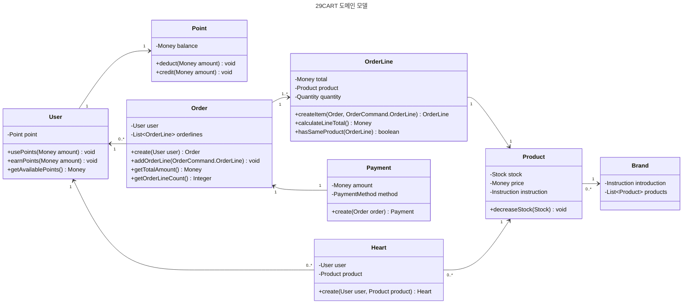

```mermaid
---
title: 29CART 도메인 모델
---
classDiagram
    direction LR

    class User {
        -Point point
        +usePoints(Money amount) void
        +earnPoints(Money amount) void
        +getAvailablePoints() Money
    }

    class Point {
        -Money balance
        +deduct(Money amount) void
        +credit(Money amount) void
    }

    class Brand {
        -Instruction introduction
        -List~Product~ products
    }

    class Heart {
        -User user
        -Product product
        +create(User user, Product product) Heart
    }

    class Product {
        -Stock stock
        -Money price
        -Instruction instruction
        +decreaseStock(Stock) void
    }

    class Order {
        -User user
        -List~OrderLine~ orderlines
        +create(User user) Order
        +addOrderLine(OrderCommand.OrderLine) void
        +getTotalAmount() Money
        +getOrderLineCount() Integer
    }

    class OrderLine {
        -Money total
        -Product product
        -Quantity quantity
        +createItem(Order, OrderCommand.OrderLine) OrderLine
        +calculateLineTotal() Money
        +hasSameProduct(OrderLine) boolean
    }

    class Payment {
        -Money amount
        -PaymentMethod method
        +create(Order order) Payment
    }

    User "1" --> "1" Point
    User "1" <-- "0..*" Order
    User "1" <-- "0..*" Heart
    Order "1" --> "1..*" OrderLine
    Order "1" <-- "1" Payment
    OrderLine "1" --> "1" Product
    Heart "0..*" --> "1" Product
    Product "0..*" --> "1" Brand
    
```