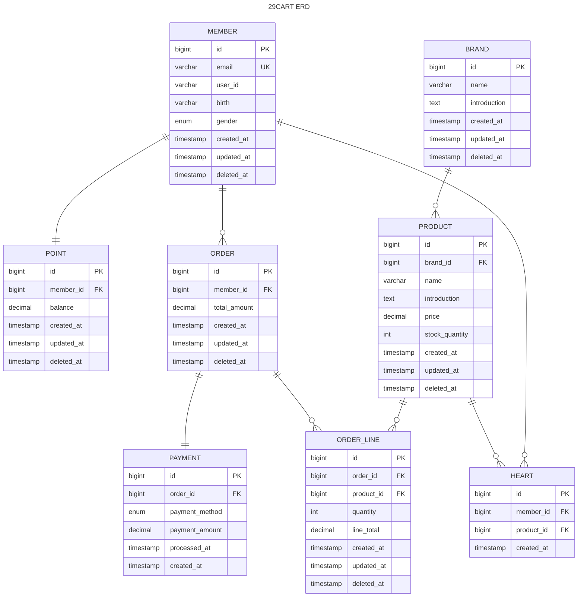

```mermaid
---
title: 29CART ERD
---
erDiagram
    MEMBER {
        bigint id PK
        varchar email UK
        varchar user_id
        varchar birth
        enum gender
        timestamp created_at
        timestamp updated_at
        timestamp deleted_at
    }

    POINT {
        bigint id PK
        bigint member_id FK
        decimal balance
        timestamp created_at
        timestamp updated_at
        timestamp deleted_at
    }

    BRAND {
        bigint id PK
        varchar name
        text introduction
        timestamp created_at
        timestamp updated_at
        timestamp deleted_at
    }

    PRODUCT {
        bigint id PK
        bigint brand_id FK
        varchar name
        text introduction
        decimal price
        int stock_quantity
        timestamp created_at
        timestamp updated_at
        timestamp deleted_at
    }

    HEART {
        bigint id PK
        bigint member_id FK
        bigint product_id FK
        timestamp created_at
    }

    ORDER {
        bigint id PK
        bigint member_id FK
        decimal total_amount
        timestamp created_at
        timestamp updated_at
        timestamp deleted_at
    }

    ORDER_LINE {
        bigint id PK
        bigint order_id FK
        bigint product_id FK
        int quantity
        decimal line_total
        timestamp created_at
        timestamp updated_at
        timestamp deleted_at
    }

    PAYMENT {
        bigint id PK
        bigint order_id FK
        enum payment_method
        decimal payment_amount
        timestamp processed_at
        timestamp created_at
    }

    MEMBER ||--|| POINT : ""
    MEMBER ||--o{ ORDER : ""
    MEMBER ||--o{ HEART : ""
    BRAND ||--o{ PRODUCT : ""
    PRODUCT ||--o{ HEART : ""
    PRODUCT ||--o{ ORDER_LINE : ""
    ORDER ||--o{ ORDER_LINE : ""
    ORDER ||--|| PAYMENT : ""
```