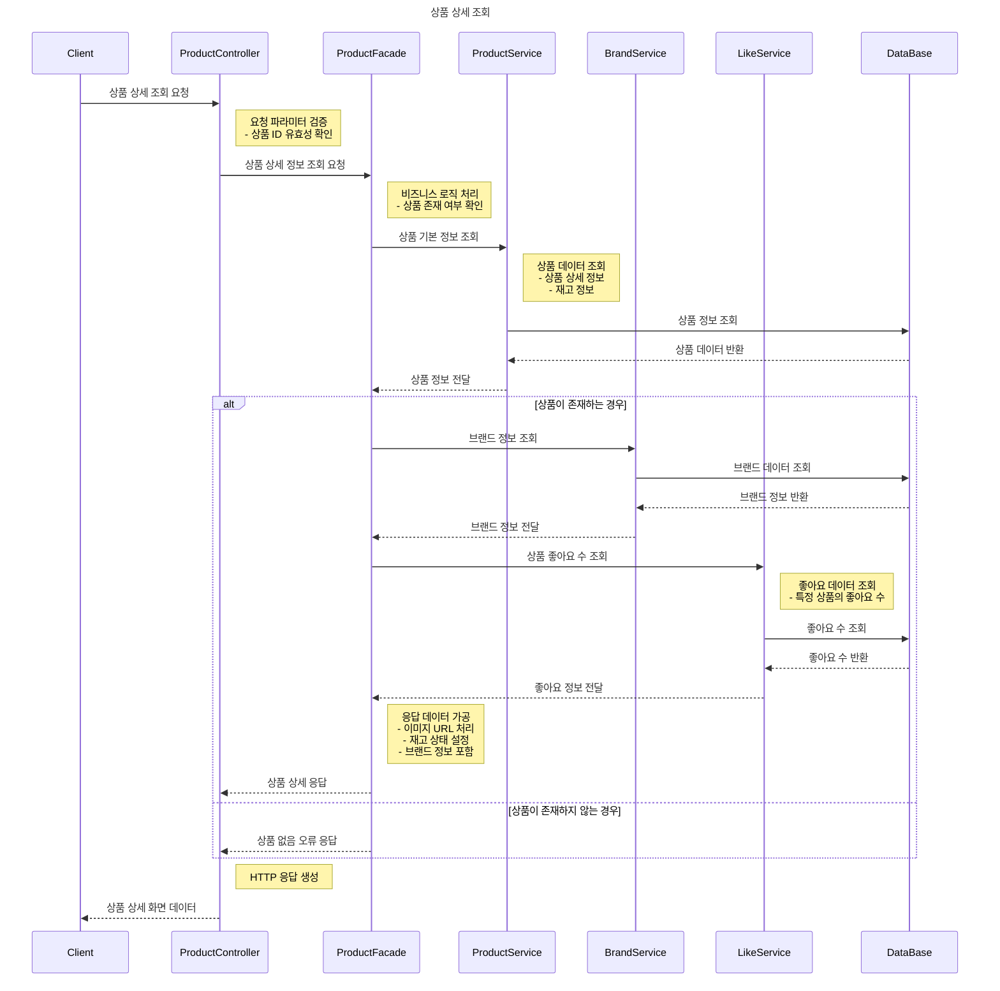

```mermaid
---
title: 상품 상세 조회
---
sequenceDiagram
    participant Client as Client
    participant Controller as ProductController
    participant Facade as ProductFacade
    participant ProductService as ProductService
    participant BrandService as BrandService
    participant LikeService as LikeService
    participant DB as DataBase

    Client->>Controller: 상품 상세 조회 요청

    Note right of Controller: 요청 파라미터 검증<br/>- 상품 ID 유효성 확인
    Controller->>Facade: 상품 상세 정보 조회 요청

    Note right of Facade: 비즈니스 로직 처리<br/>- 상품 존재 여부 확인
    Facade->>ProductService: 상품 기본 정보 조회

    Note right of ProductService: 상품 데이터 조회<br/>- 상품 상세 정보<br/>- 재고 정보
    ProductService->>DB: 상품 정보 조회
    DB-->>ProductService: 상품 데이터 반환
    ProductService-->>Facade: 상품 정보 전달

    alt 상품이 존재하는 경우
        Facade->>BrandService: 브랜드 정보 조회
        BrandService->>DB: 브랜드 데이터 조회
        DB-->>BrandService: 브랜드 정보 반환
        BrandService-->>Facade: 브랜드 정보 전달

        Facade->>LikeService: 상품 좋아요 수 조회

        Note right of LikeService: 좋아요 데이터 조회<br/>- 특정 상품의 좋아요 수
        LikeService->>DB: 좋아요 수 조회
        DB-->>LikeService: 좋아요 수 반환
        LikeService-->>Facade: 좋아요 정보 전달

        Note right of Facade: 응답 데이터 가공<br/>- 이미지 URL 처리<br/>- 재고 상태 설정<br/>- 브랜드 정보 포함
        Facade-->>Controller: 상품 상세 응답
    else 상품이 존재하지 않는 경우
        Facade-->>Controller: 상품 없음 오류 응답
    end

    Note right of Controller: HTTP 응답 생성
    Controller-->>Client: 상품 상세 화면 데이터
```