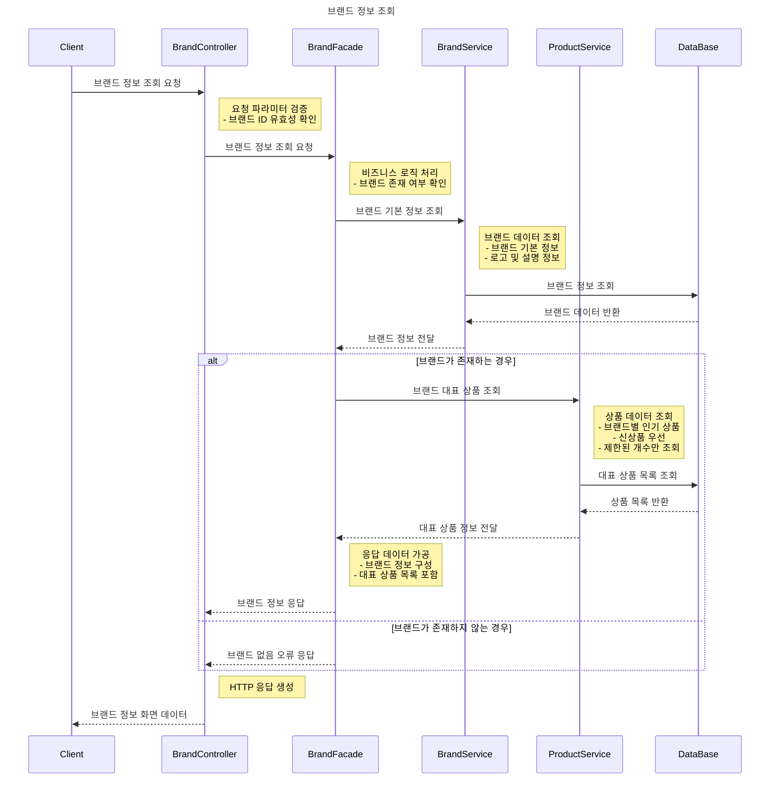

```mermaid
---
title: 브랜드 정보 조회
---
sequenceDiagram
    participant Client as Client
    participant Controller as BrandController
    participant Facade as BrandFacade
    participant BrandService as BrandService
    participant ProductService as ProductService
    participant DB as DataBase

    Client->>Controller: 브랜드 정보 조회 요청

    Note right of Controller: 요청 파라미터 검증<br/>- 브랜드 ID 유효성 확인
    Controller->>Facade: 브랜드 정보 조회 요청

    Note right of Facade: 비즈니스 로직 처리<br/>- 브랜드 존재 여부 확인
    Facade->>BrandService: 브랜드 기본 정보 조회

    Note right of BrandService: 브랜드 데이터 조회<br/>- 브랜드 기본 정보<br/>- 로고 및 설명 정보
    BrandService->>DB: 브랜드 정보 조회
    DB-->>BrandService: 브랜드 데이터 반환
    BrandService-->>Facade: 브랜드 정보 전달

    alt 브랜드가 존재하는 경우
        Facade->>ProductService: 브랜드 대표 상품 조회

        Note right of ProductService: 상품 데이터 조회<br/>- 브랜드별 인기 상품<br/>- 신상품 우선<br/>- 제한된 개수만 조회
        ProductService->>DB: 대표 상품 목록 조회
        DB-->>ProductService: 상품 목록 반환
        ProductService-->>Facade: 대표 상품 정보 전달

        Note right of Facade: 응답 데이터 가공<br/>- 브랜드 정보 구성<br/>- 대표 상품 목록 포함
        Facade-->>Controller: 브랜드 정보 응답
    else 브랜드가 존재하지 않는 경우
        Facade-->>Controller: 브랜드 없음 오류 응답
    end

    Note right of Controller: HTTP 응답 생성
    Controller-->>Client: 브랜드 정보 화면 데이터
```