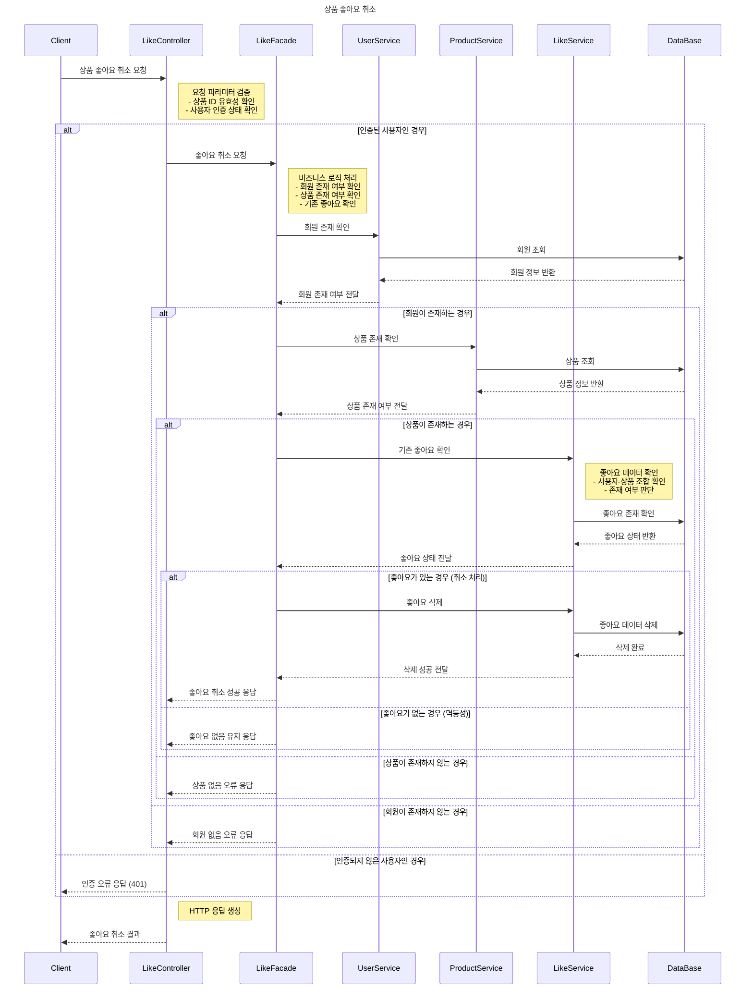

```mermaid
---
title: 상품 좋아요 취소
---
sequenceDiagram
    participant Client as Client
    participant Controller as LikeController
    participant Facade as LikeFacade
    participant UserService as UserService
    participant ProductService as ProductService
    participant LikeService as LikeService
    participant DB as DataBase

    Client->>Controller: 상품 좋아요 취소 요청

    Note right of Controller: 요청 파라미터 검증<br/>- 상품 ID 유효성 확인<br/>- 사용자 인증 상태 확인

    alt 인증된 사용자인 경우
        Controller->>Facade: 좋아요 취소 요청

        Note right of Facade: 비즈니스 로직 처리<br/>- 회원 존재 여부 확인<br/>- 상품 존재 여부 확인<br/>- 기존 좋아요 확인

        Facade->>UserService: 회원 존재 확인
        UserService->>DB: 회원 조회
        DB-->>UserService: 회원 정보 반환
        UserService-->>Facade: 회원 존재 여부 전달

        alt 회원이 존재하는 경우
            Facade->>ProductService: 상품 존재 확인
            ProductService->>DB: 상품 조회
            DB-->>ProductService: 상품 정보 반환
            ProductService-->>Facade: 상품 존재 여부 전달

            alt 상품이 존재하는 경우
                Facade->>LikeService: 기존 좋아요 확인

                Note right of LikeService: 좋아요 데이터 확인<br/>- 사용자-상품 조합 확인<br/>- 존재 여부 판단
                LikeService->>DB: 좋아요 존재 확인
                DB-->>LikeService: 좋아요 상태 반환
                LikeService-->>Facade: 좋아요 상태 전달

                alt 좋아요가 있는 경우 (취소 처리)
                    Facade->>LikeService: 좋아요 삭제
                    LikeService->>DB: 좋아요 데이터 삭제
                    DB-->>LikeService: 삭제 완료
                    LikeService-->>Facade: 삭제 성공 전달
                    Facade-->>Controller: 좋아요 취소 성공 응답
                else 좋아요가 없는 경우 (멱등성)
                    Facade-->>Controller: 좋아요 없음 유지 응답
                end
            else 상품이 존재하지 않는 경우
                Facade-->>Controller: 상품 없음 오류 응답
            end
        else 회원이 존재하지 않는 경우
            Facade-->>Controller: 회원 없음 오류 응답
        end
    else 인증되지 않은 사용자인 경우
        Controller-->>Client: 인증 오류 응답 (401)
    end

    Note right of Controller: HTTP 응답 생성
    Controller-->>Client: 좋아요 취소 결과
```