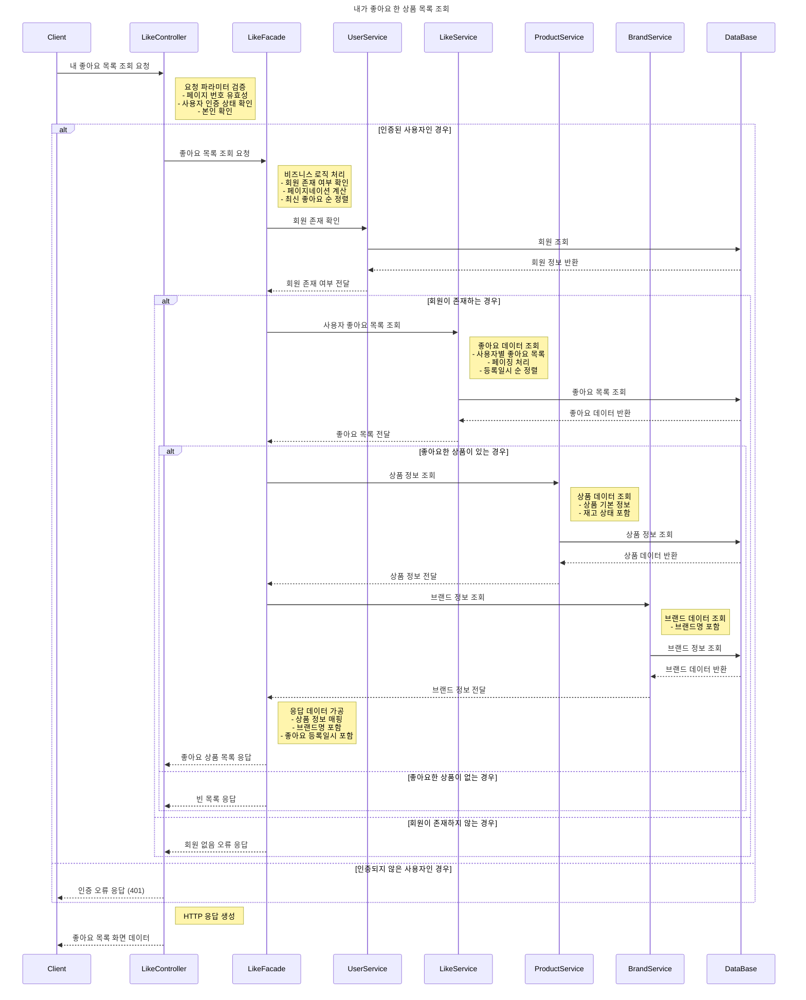

```mermaid
---
title: 내가 좋아요 한 상품 목록 조회
---
sequenceDiagram
    participant Client as Client
    participant Controller as LikeController
    participant Facade as LikeFacade
    participant UserService as UserService
    participant LikeService as LikeService
    participant ProductService as ProductService
    participant BrandService as BrandService
    participant DB as DataBase

    Client->>Controller: 내 좋아요 목록 조회 요청

    Note right of Controller: 요청 파라미터 검증<br/>- 페이지 번호 유효성<br/>- 사용자 인증 상태 확인<br/>- 본인 확인

    alt 인증된 사용자인 경우
        Controller->>Facade: 좋아요 목록 조회 요청

        Note right of Facade: 비즈니스 로직 처리<br/>- 회원 존재 여부 확인<br/>- 페이지네이션 계산<br/>- 최신 좋아요 순 정렬

        Facade->>UserService: 회원 존재 확인
        UserService->>DB: 회원 조회
        DB-->>UserService: 회원 정보 반환
        UserService-->>Facade: 회원 존재 여부 전달

        alt 회원이 존재하는 경우
            Facade->>LikeService: 사용자 좋아요 목록 조회

            Note right of LikeService: 좋아요 데이터 조회<br/>- 사용자별 좋아요 목록<br/>- 페이징 처리<br/>- 등록일시 순 정렬
            LikeService->>DB: 좋아요 목록 조회
            DB-->>LikeService: 좋아요 데이터 반환
            LikeService-->>Facade: 좋아요 목록 전달

            alt 좋아요한 상품이 있는 경우
                Facade->>ProductService: 상품 정보 조회

                Note right of ProductService: 상품 데이터 조회<br/>- 상품 기본 정보<br/>- 재고 상태 포함
                ProductService->>DB: 상품 정보 조회
                DB-->>ProductService: 상품 데이터 반환
                ProductService-->>Facade: 상품 정보 전달

                Facade->>BrandService: 브랜드 정보 조회

                Note right of BrandService: 브랜드 데이터 조회<br/>- 브랜드명 포함
                BrandService->>DB: 브랜드 정보 조회
                DB-->>BrandService: 브랜드 데이터 반환
                BrandService-->>Facade: 브랜드 정보 전달

                Note right of Facade: 응답 데이터 가공<br/>- 상품 정보 매핑<br/>- 브랜드명 포함<br/>- 좋아요 등록일시 포함
                Facade-->>Controller: 좋아요 상품 목록 응답
            else 좋아요한 상품이 없는 경우
                Facade-->>Controller: 빈 목록 응답
            end
        else 회원이 존재하지 않는 경우
            Facade-->>Controller: 회원 없음 오류 응답
        end
    else 인증되지 않은 사용자인 경우
        Controller-->>Client: 인증 오류 응답 (401)
    end

    Note right of Controller: HTTP 응답 생성
    Controller-->>Client: 좋아요 목록 화면 데이터
```