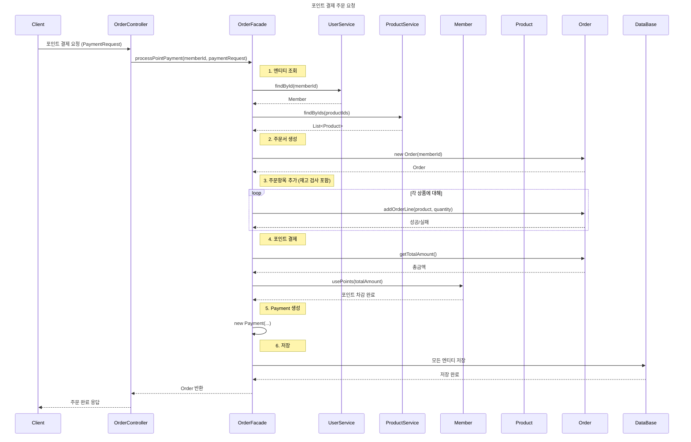

```mermaid
---
title: 포인트 결제 주문 요청
---
sequenceDiagram
   participant Client as Client
   participant Controller as OrderController
   participant Facade as OrderFacade
   participant UserService as UserService
   participant ProductService as ProductService
   participant Member as Member
   participant Product as Product
   participant Order as Order
   participant DB as DataBase

   Client->>Controller: 포인트 결제 요청 (PaymentRequest)
   Controller->>Facade: processPointPayment(memberId, paymentRequest)

   Note right of Facade: 1. 엔티티 조회
   Facade->>UserService: findById(memberId)
   UserService-->>Facade: Member
   Facade->>ProductService: findByIds(productIds)
   ProductService-->>Facade: List<Product>

   Note right of Facade: 2. 주문서 생성
   Facade->>Order: new Order(memberId)
   Order-->>Facade: Order

   Note right of Facade: 3. 주문항목 추가 (재고 검사 포함)
   loop 각 상품에 대해
       Facade->>Order: addOrderLine(product, quantity)
       Order-->>Facade: 성공/실패
   end

   Note right of Facade: 4. 포인트 결제
   Facade->>Order: getTotalAmount()
   Order-->>Facade: 총금액
   Facade->>Member: usePoints(totalAmount)
   Member-->>Facade: 포인트 차감 완료

   Note right of Facade: 5. Payment 생성
   Facade->>Facade: new Payment(...)

   Note right of Facade: 6. 저장
   Facade->>DB: 모든 엔티티 저장
   DB-->>Facade: 저장 완료

   Facade-->>Controller: Order 반환
   Controller-->>Client: 주문 완료 응답
```