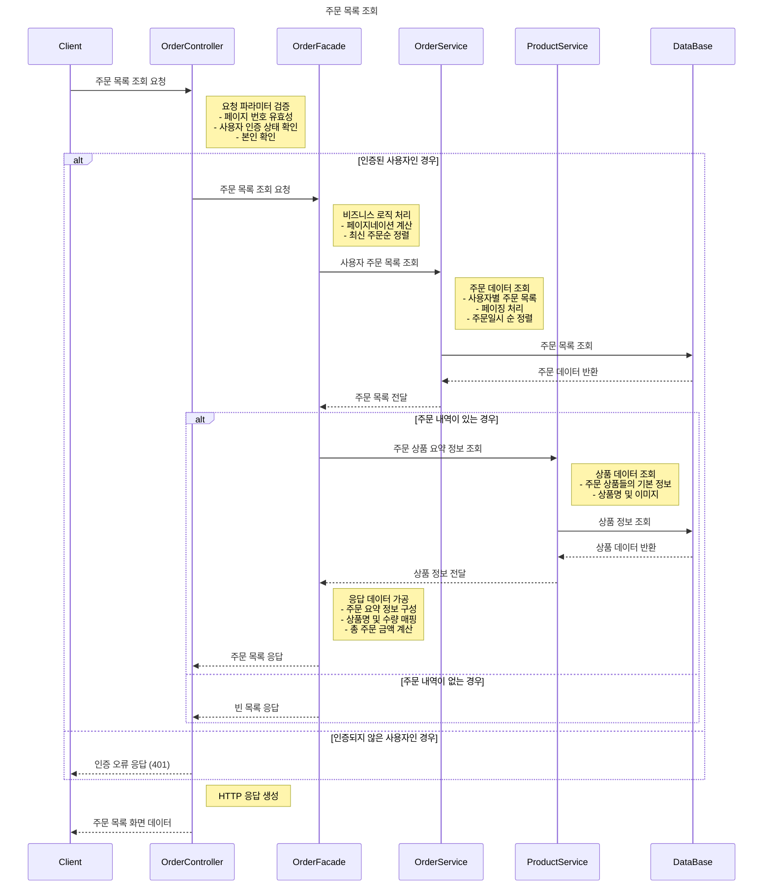

```mermaid
---
title: 주문 목록 조회
---
sequenceDiagram
    participant Client as Client
    participant Controller as OrderController
    participant Facade as OrderFacade
    participant OrderService as OrderService
    participant ProductService as ProductService
    participant DB as DataBase

    Client->>Controller: 주문 목록 조회 요청

    Note right of Controller: 요청 파라미터 검증<br/>- 페이지 번호 유효성<br/>- 사용자 인증 상태 확인<br/>- 본인 확인

    alt 인증된 사용자인 경우
        Controller->>Facade: 주문 목록 조회 요청

        Note right of Facade: 비즈니스 로직 처리<br/>- 페이지네이션 계산<br/>- 최신 주문순 정렬
        Facade->>OrderService: 사용자 주문 목록 조회

        Note right of OrderService: 주문 데이터 조회<br/>- 사용자별 주문 목록<br/>- 페이징 처리<br/>- 주문일시 순 정렬
        OrderService->>DB: 주문 목록 조회
        DB-->>OrderService: 주문 데이터 반환
        OrderService-->>Facade: 주문 목록 전달

        alt 주문 내역이 있는 경우
            Facade->>ProductService: 주문 상품 요약 정보 조회

            Note right of ProductService: 상품 데이터 조회<br/>- 주문 상품들의 기본 정보<br/>- 상품명 및 이미지
            ProductService->>DB: 상품 정보 조회
            DB-->>ProductService: 상품 데이터 반환
            ProductService-->>Facade: 상품 정보 전달

            Note right of Facade: 응답 데이터 가공<br/>- 주문 요약 정보 구성<br/>- 상품명 및 수량 매핑<br/>- 총 주문 금액 계산
            Facade-->>Controller: 주문 목록 응답
        else 주문 내역이 없는 경우
            Facade-->>Controller: 빈 목록 응답
        end
    else 인증되지 않은 사용자인 경우
        Controller-->>Client: 인증 오류 응답 (401)
    end

    Note right of Controller: HTTP 응답 생성
    Controller-->>Client: 주문 목록 화면 데이터
```