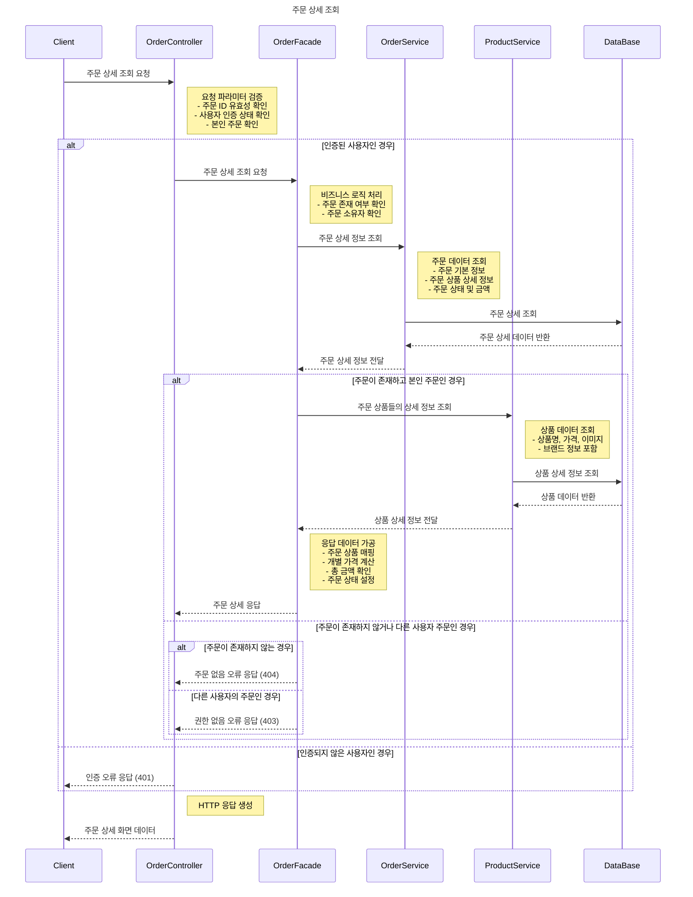

```mermaid
---
title: 주문 상세 조회
---
sequenceDiagram
    participant Client as Client
    participant Controller as OrderController
    participant Facade as OrderFacade
    participant OrderService as OrderService
    participant ProductService as ProductService
    participant DB as DataBase

    Client->>Controller: 주문 상세 조회 요청

    Note right of Controller: 요청 파라미터 검증<br/>- 주문 ID 유효성 확인<br/>- 사용자 인증 상태 확인<br/>- 본인 주문 확인

    alt 인증된 사용자인 경우
        Controller->>Facade: 주문 상세 조회 요청

        Note right of Facade: 비즈니스 로직 처리<br/>- 주문 존재 여부 확인<br/>- 주문 소유자 확인
        Facade->>OrderService: 주문 상세 정보 조회

        Note right of OrderService: 주문 데이터 조회<br/>- 주문 기본 정보<br/>- 주문 상품 상세 정보<br/>- 주문 상태 및 금액
        OrderService->>DB: 주문 상세 조회
        DB-->>OrderService: 주문 상세 데이터 반환
        OrderService-->>Facade: 주문 상세 정보 전달

        alt 주문이 존재하고 본인 주문인 경우
            Facade->>ProductService: 주문 상품들의 상세 정보 조회

            Note right of ProductService: 상품 데이터 조회<br/>- 상품명, 가격, 이미지<br/>- 브랜드 정보 포함
            ProductService->>DB: 상품 상세 정보 조회
            DB-->>ProductService: 상품 데이터 반환
            ProductService-->>Facade: 상품 상세 정보 전달

            Note right of Facade: 응답 데이터 가공<br/>- 주문 상품 매핑<br/>- 개별 가격 계산<br/>- 총 금액 확인<br/>- 주문 상태 설정
            Facade-->>Controller: 주문 상세 응답
        else 주문이 존재하지 않거나 다른 사용자 주문인 경우
            alt 주문이 존재하지 않는 경우
                Facade-->>Controller: 주문 없음 오류 응답 (404)
            else 다른 사용자의 주문인 경우
                Facade-->>Controller: 권한 없음 오류 응답 (403)
            end
        end
    else 인증되지 않은 사용자인 경우
        Controller-->>Client: 인증 오류 응답 (401)
    end

    Note right of Controller: HTTP 응답 생성
    Controller-->>Client: 주문 상세 화면 데이터
```